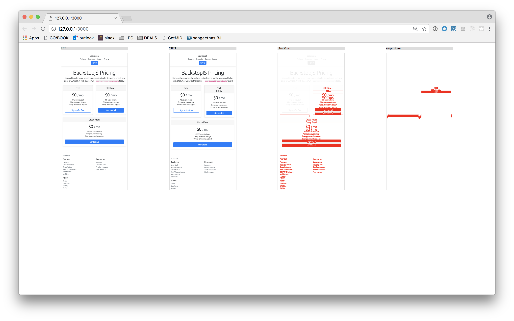

# Diverged
_Compare UI screenshots with document flow detection._




## Install the demo
**Option 1**

```
npm install diverged
```

**Option 2**

Clone the root and `cd` in there and...

```
npm install
```

## Usage

**In node**, usage looks like this. _See `/demo/index.js`_...
```
'use strict';

const REF_PATH = '../fixtures/pricing/320_ref.png';
const TEST_PATH = '../fixtures/pricing/320_test.png';
const OUTPUT_PATH = `../results/${new Date().getTime()}.png`

const diverged = require('../src/diverged-node')
const result = diverged(REF_PATH, TEST_PATH, OUTPUT_PATH);

```

***In the browser*** take a look at `/demo/index.html`


## Run the jewels
_from the `diverged` root directory_

### Node demo

```
npm run node_demo
```
...then check the `./results` directory.


### Browser demo

```
npm run serve
```
...then open [http://127.0.0.1:3000/demo/](http://127.0.0.1:3000/demo/)
